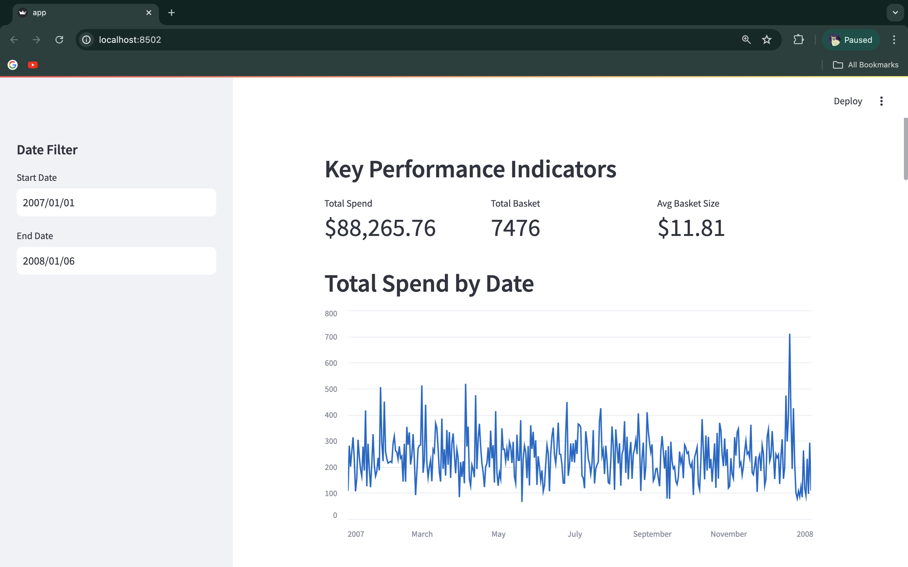
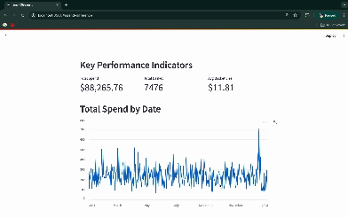

#  🔥🔥 WEBAPP dashboard with streamlit(only python)🔥🔥
- `dataset/products.csv`: Contains information about products.
- `dataset/stores.csv`: Contains information about stores.
- `dataset/transactions.csv`: Contains transaction data.
- `app.py`: The main Streamlit app script.

## Features

- Key Performance Indicators (KPIs) for total spend, total baskets, and average basket size.
- Line chart showing total spend by date.
- Table showing percentage spend difference by product code.
- Scatter plot for period-over-period spend by store code and region.
- Bar charts for cumulative spend by product code and spend difference by store region.
- Interactive data table for detailed transaction information.

## interface


## flow


### Running the App

To run the Streamlit app, navigate to the project directory and execute:

```bash
streamlit run app.py
